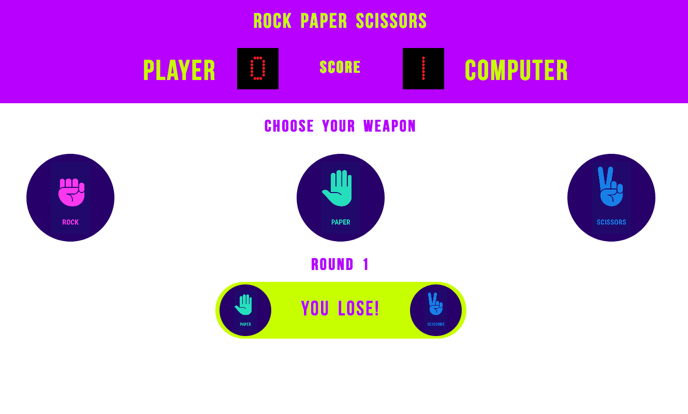

# Rock, Paper and Scissors

>This is the popular Rock, Paper Scissors game. It was built entirely with JS, HTML and CSS. This is part of the Web Development 101 | Odin Project

In this project I built an interactive Rock, Paper Scissors game. The project was built from scratch using Javascript, HTML and SCSS. The page can be loaded in small screens too.

## Built With

- Javascript, HTML, CSS
- VSCode

## Live Demo

[Rock, Paper and Scissors](https://starsheriff2.github.io/Rock-Paper-Scissors---Arturo/)

## Getting Started

To get a local copy up and running follow these simple example steps.

### Setup
1. Open your terminal or command prompt.
2. If you don't have git installed in your system, skip this step and go to step 3. If you do have git installed in your system, clone this repository to your computer in any directory you want by copying this text into your command prompt/terminal: `ghttps://github.com/StarSheriff2/Rock-Paper-Scissors---Arturo.git`. Now go to step 6.
3. If you don't have git installed in your system, you can download the program files. To do this, click on the green button that says "**Code**", on the upper right side of the project frame.
4. You will see a dropdown menu. Click on "**Download ZIP**".
5. Go to the directory where you downloaded the **ZIP file** and open it. Extract its contents to any directory you want in your system.

### Usage

1. To run the program, go to the projects's root directory (the directory where you cloned the remote repository or extracted the project files) and open the **index.html file**. This will open the game in your default browser.
2. To play the game, you simply need to click on the *weapon* of your choice.
3.  In this game, you play against the computer. The first player to reach a score of 5 points wins the game.
4.  Once the game has ended, another page will load the game results, with details for each round.

## Author

👤 **Arturo Alvarez**

- GitHub: [@StarSheriff2](https://github.com/StarSheriff2)
- Twitter: [@Turo_83](https://twitter.com/Turo_83)
- LinkedIn: [Arturo Alvarez](https://www.linkedin.com/in/arturoalvarezv/)

## Contributing

Contributions, issues, and feature requests are welcome!

Feel free to check the [issues page](https://github.com/StarSheriff2/Rock-Paper-Scissors---Arturo/issuess).

## Show your support

Give a ⭐️ if you like this project!

## 📝 License

This project is [MIT](https://github.com/StarSheriff2/Rock-Paper-Scissors---Arturo/blob/master/LICENSE) licensed.
